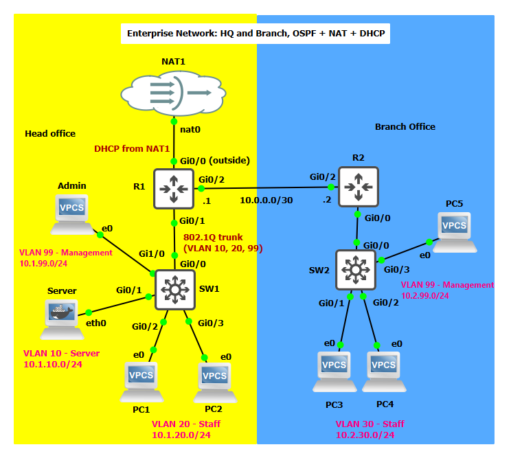

# Secure-Enterprise-Network
Two-site enterprise network with VLANs, OSPF, DHCP, NAT and ACLs, built in GNS3
 
## Objective

## Topology Diagram

## Technologies

## IP Address Table

## How To

## Verification

## Troubleshooting

## What I learned

